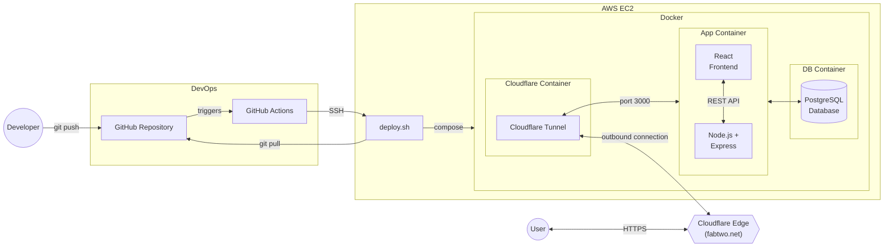
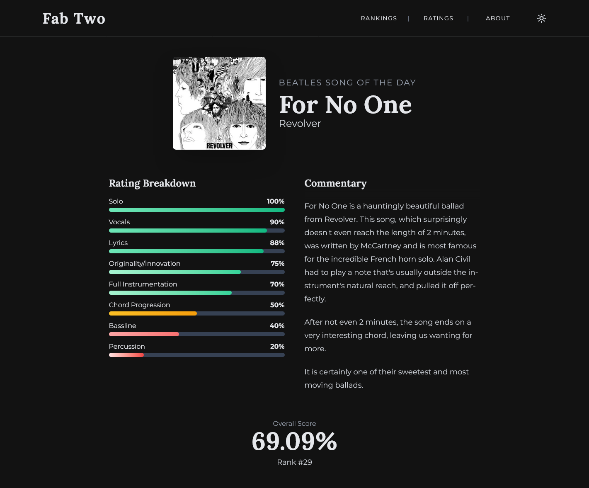
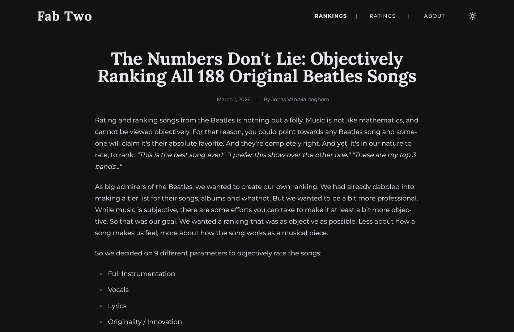
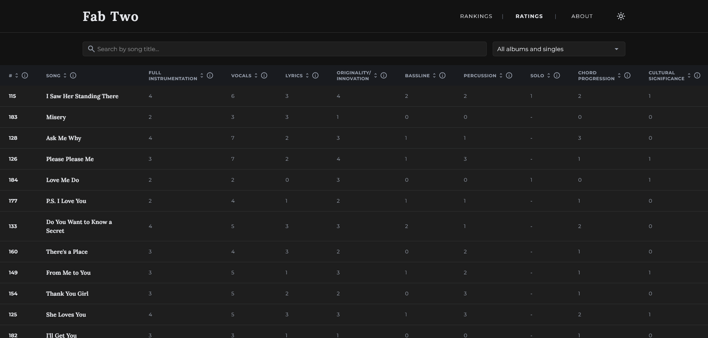

# Fab Two

## Overview

A full stack web application for sharing a systematic ranking, as well as blog posts about the Beatles. My friend and I rated every track based on multiple parameters (like instrumentation, vocals, lyrics...) to try to create an "objective" ranking of their entire discography. Our rating data and commentary for each song can be found on the site. The home page also has a "Beatles Song of the Day" feature.

Visit the website here: [fabtwo.net](https://fabtwo.net)

```mermaid
graph LR
    CF{{"Cloudflare Edge<br/>(fabtwo.net)"}}
    Developer((Developer))
    User((User))

    subgraph AWS [AWS EC2]
        Deploy[deploy.sh]

        subgraph Docker [Docker]
            subgraph AppContainer [App Container]
                Frontend[React<br/>Frontend]
                Backend[Node.js +<br/>Express]
            end

            subgraph DBContainer [DB Container]
                DB[(PostgreSQL<br/>Database)]
            end

            subgraph TunnelContainer [Cloudflare Container]
                Tunnel[Cloudflare Tunnel]
            end
        end
    end

    subgraph DevOps [DevOps]
        Repository[GitHub Repository]
        Actions[GitHub Actions]
    end

    Developer -- "git push" --> Repository
    Repository -- "triggers" --> Actions
    Actions -- "SSH" --> Deploy
    Deploy -- "git pull" --> Repository
    Deploy -- "compose" --> Docker

    Frontend <-- REST API --> Backend
    AppContainer <--> DB

    User <-- "HTTPS" --> CF
    Tunnel <-- "outbound connection" --> CF
    Tunnel <-- "port 3000" --> AppContainer
```

## Tech stack

- **Frontend:** React, Redux, Tailwind
- **Backend:** Node.js, Express, REST API
- **Database:** PostgreSQL
- **Other:** TypeScript, AWS

## Screenshots

| Home page                                        | Blog post                              | Song ratings data                            |
| ------------------------------------------------ | -------------------------------------- | -------------------------------------------- |
|  |  |  |
