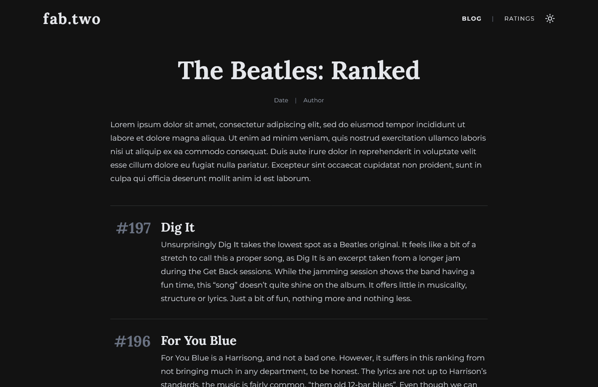

# fab.two - Beatles Website

## Overview

A full stack web application for sharing a systematic ranking of every Beatles song. My friend and I rated every track based on multiple categories (like instrumentation, vocals and lyrics) to create an objective as possible ranking of their entire discography. Our rating data and a write up for each song can be found on the site. The home page also has a daily changing "Beatles Song of the Day" feature. Link to the live website coming soon...

## Tech stack

- **Frontend:** React, Redux, Tailwind
- **Backend:** Node.js, Express, REST API
- **Database:** PostgreSQL
- **Other:** TypeScript, AWS

## Screenshots

| Home page                                       | Blog post                              | Rating data                                  |
| ----------------------------------------------- | -------------------------------------- | -------------------------------------------- |
|  |  |  |
